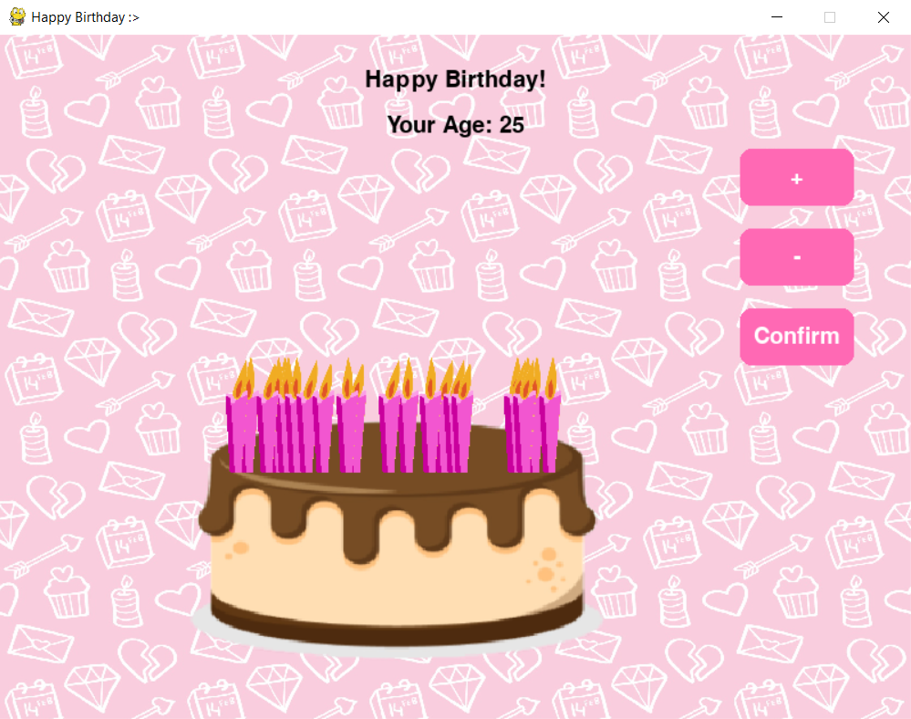
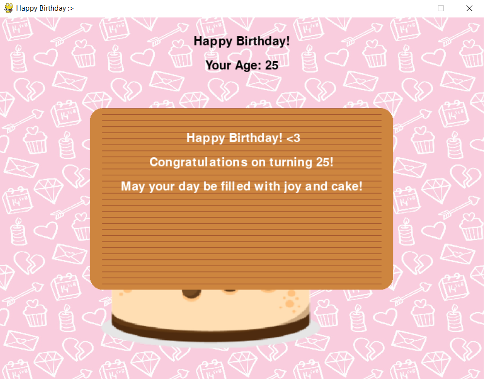
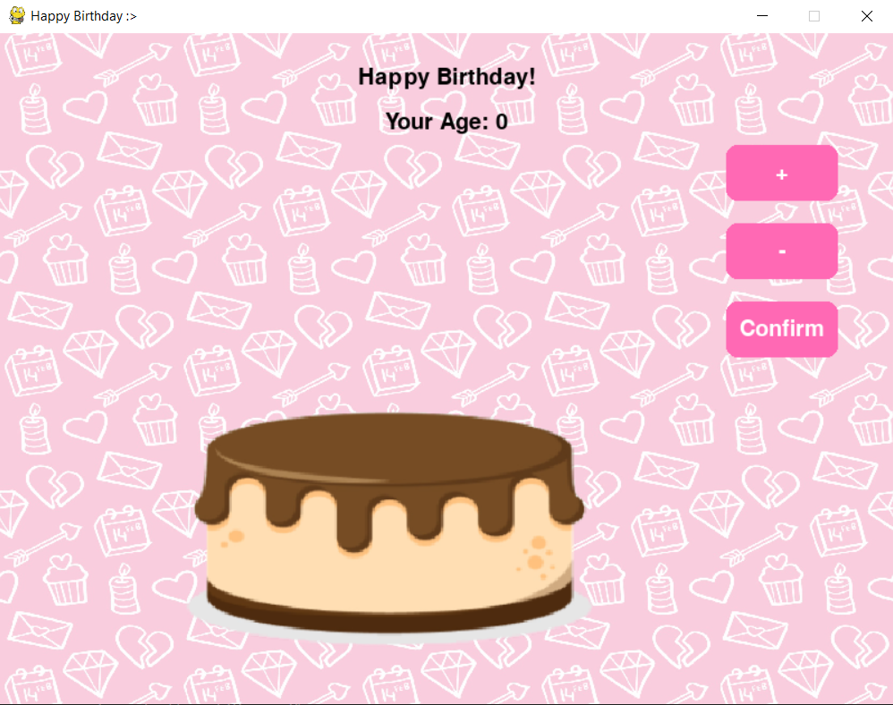
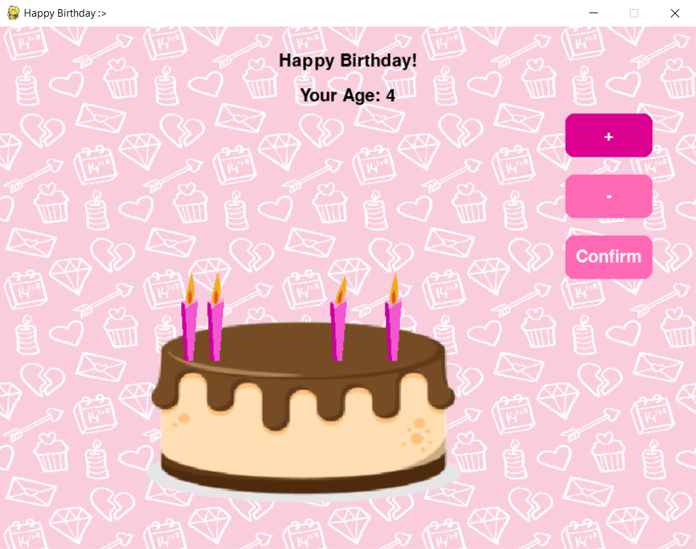
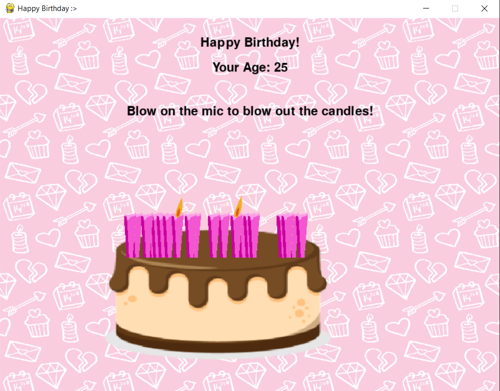

# Happy Birthday Cake - Blow Out Candles! (in Python)

<p align="center">
  
  
</p>

Want to give your long distance friend a memorable gift? Try making a virtual birthday cake with candles that blow out with a birthday card!

## ✨ Inspiration

I came across this cool [Instagram Post](https://www.instagram.com/reel/C0xoHgDLmqg/) by Mewtru. But it wasn't done using Python.

So for all the python developers out there, here's a cool gift to give your loved ones (in .exe file ofc)!

## 🍰 Features

- **Cake Screen**: Displays a single cake with a pattern background.
- **Interactive Buttons**: + sign to increase age, - sign to decrease, press CONFRIM to start blowing out candles!
- **Add Candles**: To add candles, increment the age. The older you are, the more candles!
- **Detect Mic (to blow out candles)**: Allows users to blow out the candles using mic! Blow harder to take out all the candles!
- **Birthday Card**: After blowing out the candles, a birthday card opens to wish you well!

## 🛠️ Run Project Locally

Follow the steps below to set up and run this project locally:

### Prerequisites

- Python 3.10 (I use 3.10.11)
- A suitable IDE (e.g., VS Code or PyCharm)

### Clone the Repository

```bash
git clone https://github.com/afia45/python-birthday-cake-blowing-candle.git
cd python-birthday-cake-blowing-candle
```

### Setup

- Create Virtual Environment and activate
- Install python packages
```bash
pip install pygame pyaudio numpy
```

## 🖊️ Customise Project
- **Images/Background:** Change the images in ***line #29 - #33***
- **Card Description:** Change Card Details in ***line #283*** onwards.

## 💌 Share to your loved ones (.exe file)

- Run Commands to make .exe
```bash
python -m pip install --upgrade pyinstaller
```
```bash
pyinstaller --onefile --windowed --add-data "background.png;." --add-data "cake.png;." --add-data "candle.png;." --add-data "flame_0.png;." --add-data "flame_1.png;." --add-data "flame_2.png;." --add-data "flame_3.png;." --add-data "flame_out_0.png;." --add-data "flame_out_1.png;." birthdaycake.py
```
- This will create two folders, the .exe will be in your **dist** folder!
- Make sure to **copy all the images** into your **dist folder**, or else the .exe file cannot run without images.
- Make the dist folder into a **ZIP folder** and share!

> [!NOTE]
> When sharing .exe files, Windows often detect unsigned .exe files as virus. Simply ask your friend to turn off any active Windows Antivirus Detector or Windows Security! Rest assured, the project contains no virus :>!

## 📁 Screen Shots
<p align="center">
  
  
</p>
<p align="center">
  
  
</p>
